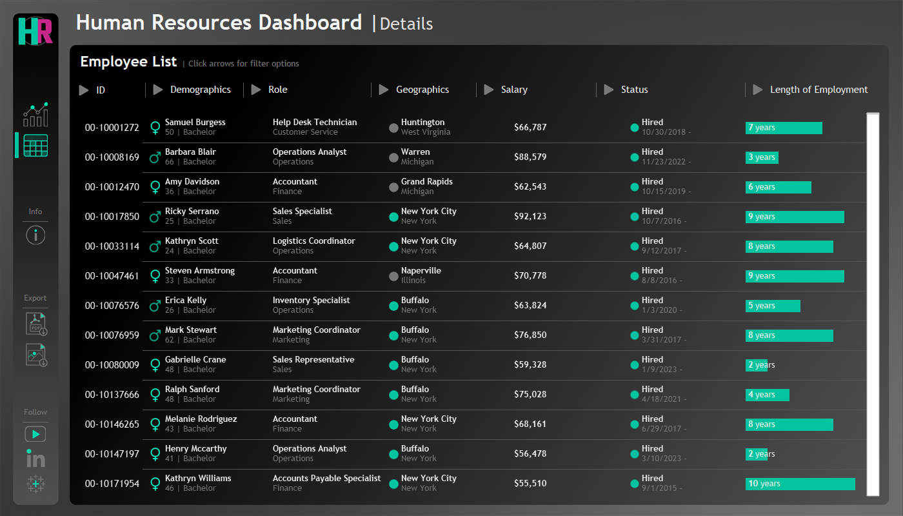

```
# 📊 HR Analytics Dashboard – Tableau Project

This project is an end-to-end HR analytics dashboard built using Tableau. It visualizes key human resources metrics to help stakeholders monitor performance, attrition, diversity, and more.
```
---


## 📁 Project Structure

```

HR Dashboard.twbx
├── HR Dashboard.twbx                # Tableau workbook (unpacked)
├── Data/
│   └── HumanResources.csv
├── Image/
├── Snippets/


```

---

## 🧠 Features

- **Employee Overview**: Summarizes demographics, roles, and department distribution.
- **Attrition Analysis**: Visualizes patterns in employee exits.
- **Salary and Performance Trends**: Insights into compensation vs. performance.
- **Interactive Filters**: Dynamic filters by department, gender, location, etc.
- **UI Elements**: Icons for download, contact, filters, and info help tooltips.
- **Professional Styling**: Custom backgrounds and iconography.

---

## 🛠️ Tools Used

- **Tableau Desktop**
- **Tableau Hyper Extracts**
- **Custom UI/UX assets** (icons and images)

---

## 📷 Screenshots

Include screenshots or a short GIF here to showcase the dashboard visuals.

---

## 📦 How to Use

1. Download the `.twbx` file.
2. Open it in Tableau Desktop.
3. Explore or modify the dashboard using the provided structure.


---

## 🔒 Disclaimer

This project uses **dummy or synthetic HR data** for demonstration purposes only. No real employee information is used.

---

## 🙋 Author & Credits

Created by Muhammad Ali

---
